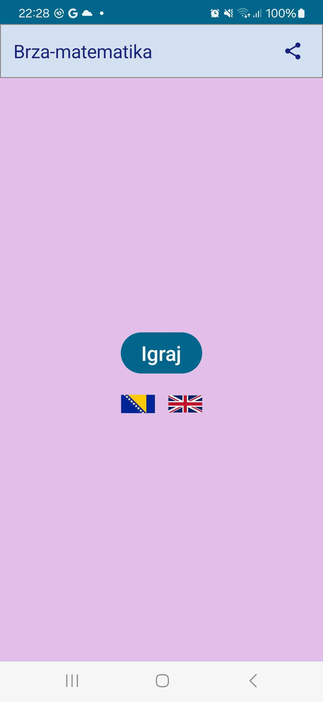
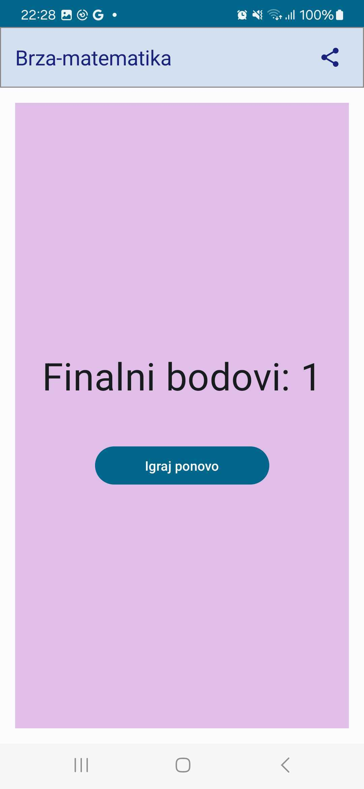

# Razvoj-Mobilnih-Aplikacija-Projekat
Prvi projekat iz Razvoja mobilnih aplikacija
# Dokumentacija za Numbers Application

## Opis rada aplikacije

Numbers Application je aplikacija za učenje matematike koja omogućava korisnicima da igraju igru u kojoj trebaju rješavati jednostavne matematičke zadatke. Korisnici mogu igrati igru za vježbanje dodavanja i oduzimanja brojeva. Aplikacija podržava promjenu jezika i dijeljenje rezultata igre.

## Opis arhitekture aplikacije

Aplikacija je izgrađena na Android platformi koristeći Kotlin programski jezik i Compose za korisnički interfejs. Arhitektura je bazirana na jednostavnom Model-View-ViewModel (MVVM) uzorku.

- **MainActivity** je glavna aktivnost koja sadrži glavni ekran aplikacije.
- **MainScreen** prikazuje glavni ekran sa opcijom za pokretanje igre, dijeljenje i promjenu jezika.
- **PlayScreen** omogućava korisnicima da pokrenu igru i promijene jezik.
- **Game** sadrži logiku igre, uključujući generisanje pitanja, unos korisnika, računanje rezultata i završetak igre.
- **GameScreen** prikazuje samu igru, uključujući pitanja, unos korisnika, tajmer i povratne informacije.
- **FinalScoreScreen** prikazuje konačni rezultat igre i opciju za ponovno igranje.

## Opis funkcionalnosti pojedinačnih klasa

### MainScreen.kt

Prikazuje glavni ekran aplikacije. Omogućava korisniku da pokrene igru, dijeli rezultate i mijenja jezik.

### PlayScreen.kt

Omogućava korisniku da pokrene igru. Omogućava korisniku da mijenja jezik aplikacije.

### Game.kt

Sadrži logiku igre, uključujući generisanje pitanja, unos korisnika, računanje rezultata i završetak igre. Komunicira sa **GameScreen** i **FinalScoreScreen**.

### GameScreen.kt

Prikazuje igru korisniku. Omogućava unos korisnika, prikazuje pitanja i povratne informacije.

### FinalScoreScreen.kt

Prikazuje konačni rezultat igre korisniku. Omogućava korisniku da započne novu igru.

## Opis opštih koncepata Android frameworka

1. **Aktivnost (Activity)**:
    - **MainActivity** je osnovna aktivnost aplikacije koja pokreće glavni ekran.

2. **Životni ciklus (Lifecycle)**:
    - Aktivnosti i komponente u aplikaciji slijede Androidov životni ciklus koji uključuje kreiranje, pokretanje, pauziranje, zaustavljanje i uništavanje.

3. **Korutine (Coroutines)**:
    - Koriste se za asinkrono izvršavanje dugotrajnih operacija kao što je tajmer u **GameScreen**.

4. **Compose**:
    - Koristi se za izgradnju korisničkog interfejsa aplikacije, omogućavajući deklarativan način definiranja UI komponenti.

---
## Funkcija: GameScreen

### Opis:

`GameScreen` funkcija prikazuje glavni ekran igre za rješavanje jednostavnih matematičkih operacija. Korisnik treba riješiti postavljene zadatke i unutar određenog vremena unijeti svoj odgovor. Funkcija prati rezultat, vrijeme i broj pokušaja.

### Parametri:

- `onGameEnd`: Lambda funkcija koja se poziva kada igra završi. Kao argument prima ukupan broj bodova.

### Varijable stanja:

- `userInput`: Sadrži tekstualni unos korisnika (odgovor na zadatak).
- `savedNumber`: Sadrži prethodno uneseni broj korisnika (ako je unio).
- `score`: Broj bodova ostvarenih tokom igre.
- `attempts`: Broj pokušaja koje je korisnik imao tokom igre.
- `end`: Logička vrijednost koja označava da li je igra završena.
- `timerFinished`: Logička vrijednost koja označava da li je vrijeme za rješavanje zadatka isteklo.
- `timer`: Brojač preostalog vremena za rješavanje zadatka (u sekundama).
- `firstRandomNumber`: Prvi slučajni broj generiran za postavljeni zadatak.
- `randomSign`: Slučajni operator (+ ili -) koji se koristi u postavljenom zadatku.
- `secondRandomNumber`: Drugi slučajni broj generiran za postavljeni zadatak.
- `result`: Ispravan rezultat postavljenog zadatka.
- `feedbackMessage`: Poruka za korisnika koja se prikazuje nakon unosa odgovora.

### Funkcije:

- `generateNewQuestion`: Generira novi matematički zadatak sa novim slučajnim brojevima i operatorom.

### LaunchedEffect:

- **Prvi LaunchedEffect**: Prati promjenu broja pokušaja (`attempts`). Resetira tajmer i broji od 5 do 0 sekundi. Provjerava da li je korisnik unio odgovor i prikazuje poruku o grešci ako nije. Povećava broj pokušaja i generira novi zadatak ili završava igru ako je broj pokušaja dostigao maksimum.

- **Drugi LaunchedEffect**: Prati promjenu poruke za korisnika (`feedbackMessage`). Uklanja poruku nakon 2 sekunde.

### Sadržaj ekrana:

- **Score i preostalo vrijeme**: Prikazuje trenutni broj bodova i preostalo vrijeme za rješavanje zadatka.
- **Broj runde**: Prikazuje trenutni broj runde (pokušaja).
- **Matematički zadatak**: Prikazuje postavljeni zadatak sa dva broja i operatorom.
- **Unos odgovora**: Polje za unos korisničkog odgovora.
- **Spremi odgovor**: Dugme za provjeru korisničkog odgovora.
- **Poruka za korisnika**: Prikazuje poruku o ispravnom ili neispravnom odgovoru ili nedostajućem unosu.

### Akcija dugmeta "Spremi odgovor":

- Provjerava da li je korisnik unio broj.
- Ako je broj unesen, provjerava da li je odgovor ispravan.
- Povećava broj bodova za ispravan odgovor.
- Prikazuje poruku o ispravnom ili neispravnom odgovoru.
- Generira novi zadatak i resetira unos odgovora i tajmer.
- Završava igru ako je broj pokušaja dostigao maksimum i poziva funkciju `onGameEnd` za prikaz konačnog rezultata.

---
## Funkcija: Game

### Opis:

`Game` funkcija upravlja cjelokupnim tijekom igre. Ona prikazuje `GameScreen` dok igra traje, a zatim prikazuje `FinalScoreScreen` kada igra završi.

### Parametri:

- `onGameEnd`: Lambda funkcija koja se poziva kada igra završi. Kao argument prima ukupan broj bodova.
- `currentLocale`: Trenutno odabrani jezik aplikacije (objekt klase `Locale`).
- `onChangeLanguageClick`: Lambda funkcija koja se poziva kada korisnik klikne na promjenu jezika. Kao argument prima željeni jezik (objekt klase `Locale`).

### Varijable stanja:

- `showFinalScore`: Logička vrijednost koja označava da li se treba prikazati ekran sa konačnim rezultatom.
- `score`: Broj bodova ostvarenih tokom igre.

### Funkcije:

- `onGameEnd`: Interna funkcija koja se poziva iz `GameScreen` funkcije kada igra završi. Postavlja konačni rezultat (`score`) i prikazuje ekran sa konačnim rezultatom.
- `onPlayAgain`: Interna funkcija koja se poziva kada korisnik klikne na dugmić za ponovnu igru na ekranu sa konačnim rezultatom. Resetira rezultat i prikazuje `GameScreen` za početak nove igre.

### Logika prikaza:

Funkcija provjerava `showFinalScore` varijablu.
- Ako je `showFinalScore` True, prikazuje se `FinalScoreScreen` sa trenutnim rezultatom i dugmićem za ponovnu igru.
- Ako je `showFinalScore` False, prikazuje se `GameScreen`.

### Povezanost sa drugim komponentama:

- `GameScreen`: Funkcija se koristi tokom igre za prikazivanje postavki zadataka, unosa odgovora i upravljanja tijekom igre.
- `FinalScoreScreen`: Funkcija se koristi nakon završetka igre za prikazivanje konačnog rezultata i dugmića za ponovnu igru.

---
## Funkcija: FinalScoreScreen

### Opis:

`FinalScoreScreen` funkcija prikazuje ekran sa konačnim rezultatom igre. Ekran prikazuje broj osvojenih bodova i dugmić za ponovnu igru.

### Parametri:

- `score`: Broj bodova ostvarenih tokom igre.
- `onPlayAgain`: Lambda funkcija koja se poziva kada korisnik klikne na dugmić za ponovnu igru.

### Sadržaj ekrana:

- **Konačni rezultat**: Prikazuje tekst sa konačnim rezultatom igre (broj bodova).
- **Igraj ponovo**: Dugmić koji resetira igru i vraća korisnika na `GameScreen`.

### Akcija dugmića "Igraj ponovo":

Poziva `onPlayAgain` funkciju proslijeđenu kao parametar.

---
## Funkcija: MainScreen

### Opis:

`MainScreen` funkcija prikazuje glavni ekran aplikacije. Ekran nudi korisniku mogućnost pokretanja igre, dijeljenja informacija o igri i promjene jezika aplikacije. Zavisno od stanja `isPlaying`, prikazuje se `PlayScreen` ili `GameScreen`.

### Varijable stanja:

- `isPlaying`: Logička vrijednost koja označava da li je igra trenutno u toku.

### Parametri funkcije:

Parametri funkcije nisu definirani jer se koriste lokalne varijable i stanja unutar funkcije.

### Logika prikaza:

Funkcija provjerava `isPlaying` varijablu.
- Ako je `isPlaying` True, prikazuje se `GameScreen` za igranje.
- Ako je `isPlaying` False, prikazuje se `PlayScreen` za početak igre.

### Komponente:

- `NumbersTopAppBar`: Komponenta za vršnu traku aplikacije koja sadrži naslov i dugmić za dijeljenje.
- `PlayScreen`: Ekran za početak igre, dijeljenje i promjenu jezika.
- `GameScreen`: Ekran za igranje igre.

### Funkcionalnost dugmića:

- **Dugmić za dijeljenje**: Poziva `shareContent` funkciju za dijeljenje informacije o igri.
- **Dugmić za početak igre (PlayScreen)**: Postavlja `isPlaying` na True i prikazuje `GameScreen`.

### Ostale funkcije:

- `changeLanguage`: Funkcija za promjenu jezika aplikacije. Ažurira lokalitet aplikacije i postavlja `currentLocale` varijablu.
- `shareContent`: Funkcija za dijeljenje informacija o igri koristeći Intent.

---
## Funkcija: NumbersTopAppBar

### Opis:

`NumbersTopAppBar` funkcija prikazuje vršnu traku aplikacije sa naslovom i dugmićem za dijeljenje.

### Parametri:

- `title`: Tekst naslova koji se prikazuje na vršnoj traci.
- `onShareClick`: Lambda funkcija koja se poziva kada korisnik klikne na dugmić za dijeljenje.

### Sadržaj:

- **Pozadina**: Siva bordura oko cijele trake.
- **TopAppBar komponenta**: Sadrži naslov i dugmić za dijeljenje.
- **Naslov**: Prikazuje proslijeđeni tekst `title`.
- **Dugmić za dijeljenje**: Ikona dijeljenja koja poziva `onShareClick` funkciju pri kliku.

### Boje:

- **Pozadina trake**: Color(0xFFD3E0F0) (svjetlosiva)
- **Boja teksta naslova**: Crna
- **Boja ikone dijeljenja**: Crna

---
## Funkcija: PlayScreen

### Opis:

`PlayScreen` funkcija prikazuje ekran za početak igre. Ekran sadrži dugmić za početak igre, dugmić za dijeljenje informacije o igri i zastave za promjenu jezika aplikacije.

### Parametri:

- `onStartGame`: Lambda funkcija koja se poziva kada korisnik klikne na dugmić za početak igre.
- `onShareClick`: Lambda funkcija koja se poziva kada korisnik klikne na dugmić za dijeljenje.
- `onChangeLanguageClick`: Lambda funkcija koja se proslijeduje komponenti zastava za promjenu jezika.
- `currentLocale`: Trenutno odabrani jezik aplikacije (objekt klase Locale).

### Sadržaj ekrana:

- **Dugmić za početak igre**: Poziva `onStartGame` funkciju pri kliku i započinje igru.
- **Zastave**:
    - Zastava Bosne i Hercegovine: Postavlja jezik aplikacije na bosanski (bs) pri kliku.
    - Zastava Ujedinjenog Kraljevstva: Postavlja jezik aplikacije na engleski (Locale.ENGLISH) pri kliku.

### Boje:

- **Pozadina ekrana**: Color(0xFFE1BEE7) (svjetlolila)

---

### Zaključak

Numbers Application je mobilna aplikacija koja pruža zabavno i obrazovno iskustvo korisnicima, omogućavajući im da vježbaju matematičke vještine kroz jednostavnu igru. Kroz opsežno korištenje Android frameworka, aplikacija je optimizovana za performanse i korisničko iskustvo, obezbjeđujući stabilnost i intuitivno korisničko sučelje.

---
### Početni ekran i kraj igrice

    

        
    

    

        
    

---
### Izgled Igrice

    
    

